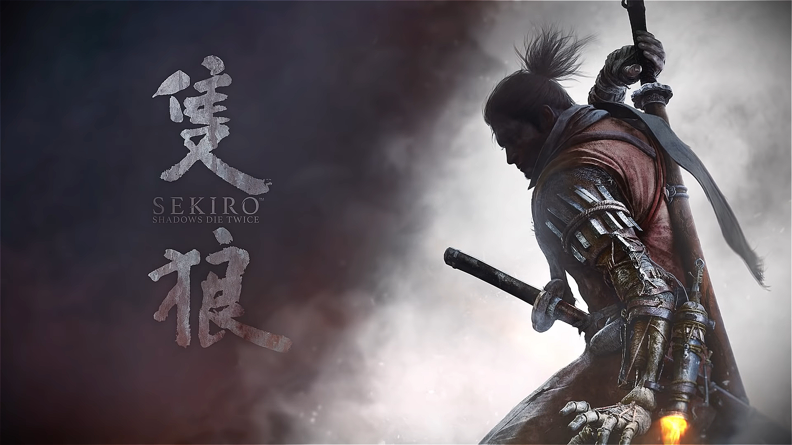

# **The best action game of 2019 "Sekiro: Shadows Die Twice"**

The map of this game is three-dimensional, with the help of the **grappling hook**, players will find that everywhere is full of _excitement_ and _surprise_ no matter what angle the players can't see the whole picture. Maybe you will find a hint when the cliff is like a ninja-like cornice walking on the wall; if you climb the tree and find the route that the enemy cannot find, there may be **rare items**, or there may be a **strong enemy**. In short, the eaves-walking exploration method combined with the three-dimensional exquisite map makes the game fun to explore. This [article](https://www.theverge.com/2019/3/22/18277376/sekiro-shadows-die-twice-review-xbox-ps4-pc) is like a review by other players and there are more detials telling you why this game is fun and hard:

> _Sekiro_ is the new game from Dark Souls studio From Software and its renowned director Hidetaka Miyazaki. Comparing games to Dark Souls is a well-trodden cliche at this point, and while there’s more reason to do so with Sekiro than most, it’s the differences that make it interesting. A fantastical take on Japan’s ninja mythology, Sekiro is much more of a straightforward action game than the Souls series, giving you a predefined character, storyline, and set of tools.

more information about this game:
- If you feel hard when play this game, click this [clip](https://www.youtube.com/watch?v=GfjxTIHQheg) to find more guide for beginners.
- Here is a [shortcut](https://store.steampowered.com/app/814380/Sekiro_Shadows_Die_Twice/) for you to purchase this game and find out more rating and comments about it.
- You can even install many [mods](https://www.nexusmods.com/sekiro/mods/) into this game for fun.
